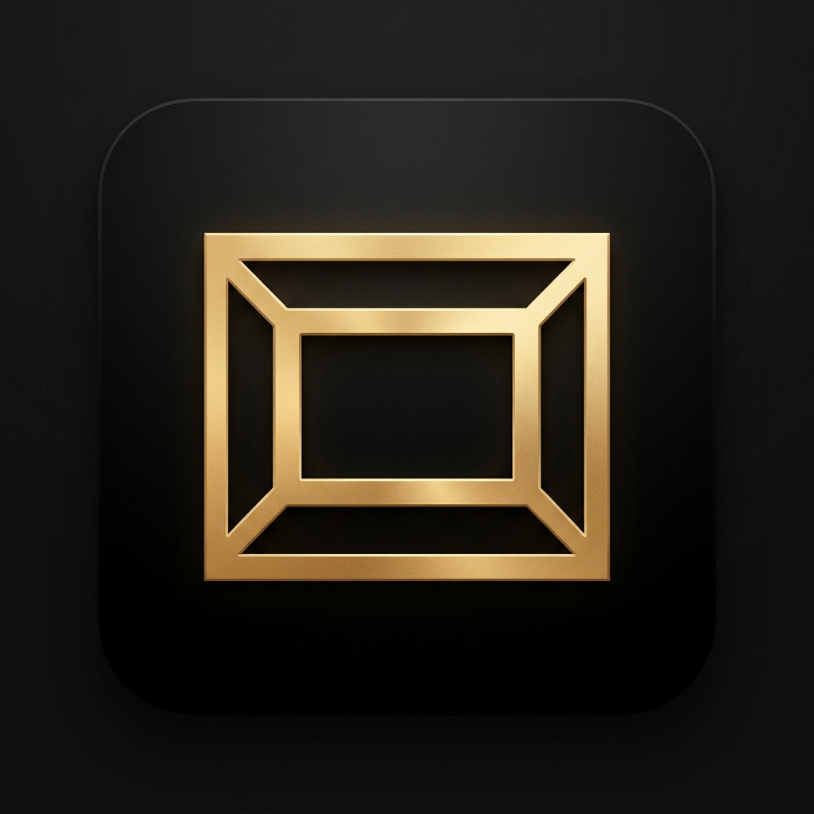

<p align="center">
  
</p>

<h1 align="center">FRAME</h1>

<p align="center">
  <strong>An intentional, distraction-free cinema vault & OTT streaming release tracker for cinephiles.</strong>
</p>

<p align="center">
  <a href="https://github.com/KARTHIKKJ369/watchlist/actions/workflows/release-apk.yml"></a>
  <a href="https://github.com/KARTHIKKJ369/watchlist/releases"></a>
  
  
  
  
</p>

---

## Overview

**FRAME** is a high-performance cinema logging and tracking system designed for film enthusiasts. Built with a responsive, editorial design system, FRAME combines deep movie/TV metadata from TMDB, live regional OTT release tracking, watch statistics, and real-time cloud vault synchronization into a single unified web and native Android application.

---

## Key Features

### Personal Cinema Vault
- **Complete Library Management**: Track films and television series across four distinct watch states: *Watching*, *Plan to Watch*, *Completed*, and *Dropped*.
- **Personal Ratings & Notes**: Log decimal ratings, custom review notes, rewatch counts, and custom tagging.
- **Search & Filtering**: Multi-dimensional filtering by media type, watch status, genre tags, sort order, and real-time text query.
- **JSON Import / Export**: Full data ownership with one-click JSON backup and migration.

### Streaming & Digital Release Radar
- **Live Regional Availability**: Real-time streaming provider availability (Netflix, Prime Video, Disney+ Hotstar, Apple TV+, MUBI, and more) filtered by your country.
- **Digital Release Calendar**: Track upcoming digital premieres and OTT release dates in a dedicated release radar.

### Deep Cinephile Metadata
- **Automated Enrichment**: Live TMDB synchronization for directors, cinematographers, composers, writers, full cast, synopsis, runtime, age certifications, box office revenue, and production companies.
- **Integrated Video Player**: Stream official trailers directly inside the detail sheet.

### Insights & Analytics
- **Viewing Statistics**: Automated breakdown of total runtime watched, average user rating, movie vs. TV split, and top 5 genre distribution charts.

### Native Android Experience
- **Edge-to-Edge Design**: Full support for Android notches, camera cutouts, and gesture navigation bars.
- **Hardware Back Button Handling**: Hierarchical back navigation (dismisses active modals first, then returns to the home tab, then minimizes the app).
- **Native Haptics & Theming**: Tactile vibration feedback on interactions and dynamic status bar color coordination matching both dark (`#0a0a0c`) and editorial light (`#f6f5f2`) themes.
- **Lightweight Footprint**: Optimized native APK footprint under 5 MB.

### Hybrid Cloud Sync & Offline-First
- **Local-First Speed**: Instant reads and writes backed by `localStorage`.
- **Cloudflare Serverless Sync**: Optional account-based real-time cloud synchronization backed by Cloudflare Workers and Cloudflare D1 SQL database.

---

## Tech Stack & Architecture

| Layer | Technologies |
| :--- | :--- |
| **Frontend Web** | React 19, TypeScript, Vite 8, Framer Motion, Phosphor Icons, Lucide Icons, Vanilla OKLCH CSS |
| **Mobile Runtime** | Capacitor 8 (`@capacitor/android`, `@capacitor/app`, `@capacitor/status-bar`, `@capacitor/haptics`, `@capacitor/splash-screen`) |
| **Backend & Storage** | Cloudflare Workers, Cloudflare D1 (SQLite Edge Database), Wrangler CLI |
| **Data Provider** | The Movie Database (TMDB) API v3 / v4 |
| **CI / CD** | GitHub Actions (Automated Android APK build & GitHub Releases) |

---

## Getting Started

### Prerequisites

- **Node.js**: `v22.0.0` or higher
- **npm**: `v10.0.0` or higher
- **TMDB API Key**: Free API key from [The Movie Database](https://www.themoviedb.org/settings/api)
- *(Optional for Android builds)*: **Android Studio** with Android SDK (API 34+) and Java 21 JDK.

### 1. Clone & Install Dependencies

```bash
git clone https://github.com/KARTHIKKJ369/watchlist.git
cd watchlist
npm install
```

### 2. Configure Environment Variables

Create a `.env` file in the root directory:

```bash
cp .env.example .env
```

Populate the `.env` variables:

```env
# TMDB API Credentials
VITE_TMDB_READ_ACCESS_TOKEN=your_tmdb_v4_read_access_token
VITE_TMDB_API_KEY=your_tmdb_v3_api_key

# Cloudflare Worker Backend URL (optional for cloud sync)
VITE_API_URL=https://frame.your-domain.workers.dev
```

### 3. Run Web App Locally

```bash
npm run dev
```

Open [http://localhost:5173](http://localhost:5173) in your browser.

---

## Android Development & APK Builds

The project includes a pre-configured native Android application managed via Capacitor.

### Open Project in Android Studio

```bash
npm run cap:open
```

### Sync Web Changes to Android

After modifying frontend code or styles, sync the assets to the Android platform:

```bash
npm run cap:sync
```

### Build Debug APK from Terminal

To compile a native APK directly:

```bash
npm run cap:build:apk
```

The compiled APK will be output to:
```
android/app/build/outputs/apk/debug/app-debug.apk
```

### Sideload to USB-Connected Android Device

```bash
adb install -r android/app/build/outputs/apk/debug/app-debug.apk
```

---

## Automated GitHub Releases (CI/CD)

The repository includes a GitHub Actions workflow ([`.github/workflows/release-apk.yml`](.github/workflows/release-apk.yml)) that automatically builds and attaches `FRAME.apk` to GitHub Releases.

To publish a new release:

```bash
# 1. Commit and push your changes
git add .
git commit -m "feat: release description"
git push origin main

# 2. Tag and push a version tag
git tag v1.0.3
git push origin v1.0.3
```

GitHub Actions will automatically build the APK and publish the release at `https://github.com/KARTHIKKJ369/watchlist/releases`.

---

## Backend Deployment (Cloudflare Workers + D1)

The backend provides authentication and multi-device vault synchronization using Cloudflare D1 SQL database.

### 1. Create Cloudflare D1 Database

```bash
npx wrangler d1 create frame_db
```

Update `wrangler.toml` with the generated `database_id`:

```toml
[[d1_databases]]
binding = "frame_db"
database_name = "frame_db"
database_id = "your-d1-database-id"
```

### 2. Deploy Worker & Static Assets

```bash
# Build frontend static bundle
npm run build

# Deploy fullstack worker and assets to Cloudflare Edge
npx wrangler deploy
```

> [!NOTE]
> Database schemas and indices are self-initializing on the first incoming request.

---

## Project Structure

```
watchlist/
├── .github/
│   └── workflows/
│       └── release-apk.yml          # GitHub Actions Android build & release pipeline
├── android/                         # Native Android Studio project & Gradle config
├── assets/                          # App icon and splash screen source assets
├── cloudflare-worker/
│   └── src/
│       └── index.ts                 # Serverless D1 database API & auth backend
├── public/                          # Static web assets, logos, and sitemap
├── src/
│   ├── components/                  # React UI components (Modals, Grids, Navbar, Pages)
│   ├── context/
│   │   └── WatchlistContext.tsx     # Central application state & sync manager
│   ├── services/
│   │   ├── cloudSync.ts             # Cloudflare D1 backend API client
│   │   ├── nativeService.ts         # Capacitor native Android bridges (Back button, Haptics)
│   │   └── tmdbApi.ts               # TMDB search, details & regional OTT fetcher
│   ├── types/
│   │   └── index.ts                 # TypeScript type definitions
│   ├── App.tsx                      # Root component & native event wiring
│   ├── index.css                    # Design system tokens, OKLCH themes & safe areas
│   └── main.tsx                     # Application entry point
├── capacitor.config.ts              # Capacitor native runtime configuration
├── package.json                     # Project scripts and dependencies
├── vite.config.ts                   # Vite configuration
└── wrangler.toml                    # Cloudflare Workers & D1 configuration
```

---

## Available Scripts

| Command | Description |
| :--- | :--- |
| `npm run dev` | Starts Vite local development server with HMR |
| `npm run build` | Runs TypeScript typecheck and compiles production web bundle |
| `npm run preview` | Locally previews the compiled production build |
| `npm run lint` | Runs Oxlint linter across the codebase |
| `npm run cap:sync` | Builds web app and synchronizes assets to the Android native project |
| `npm run cap:open` | Opens the Android project in Android Studio |
| `npm run cap:build:apk` | Compiles the Android debug APK using Gradle and OpenJDK 21 |
